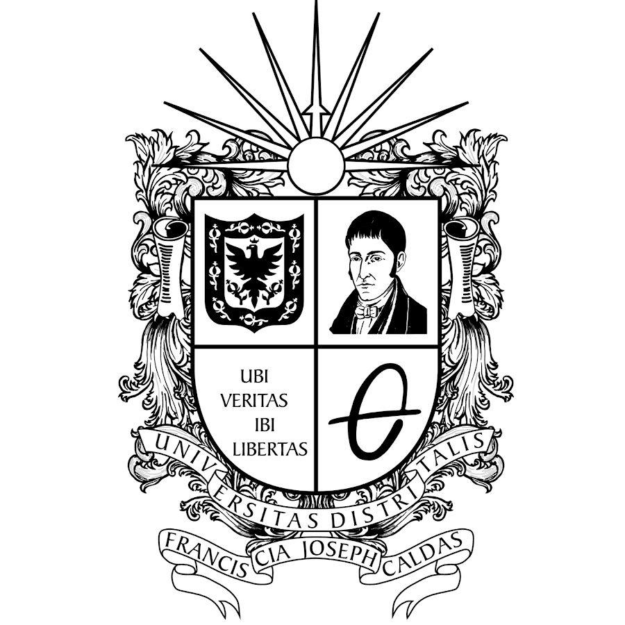

# Proyecto-Habitabilidad

Project made by:
- Jhojan Steven Aragon Ramirez 20221020060
- Santiago Reyes Gomez 20221020098
- Juan Diego Lozada Gonzalez 20222020014

This project is about make simulations in a buliding with the purpose to indicate how habitable is, according the light the building and the light given by the climate

(aqui iria una imagen del programa xd, vayan metiendo cositas)

This Project is the final test of Computer Science 2 in University Distrital Jose de Caldas

